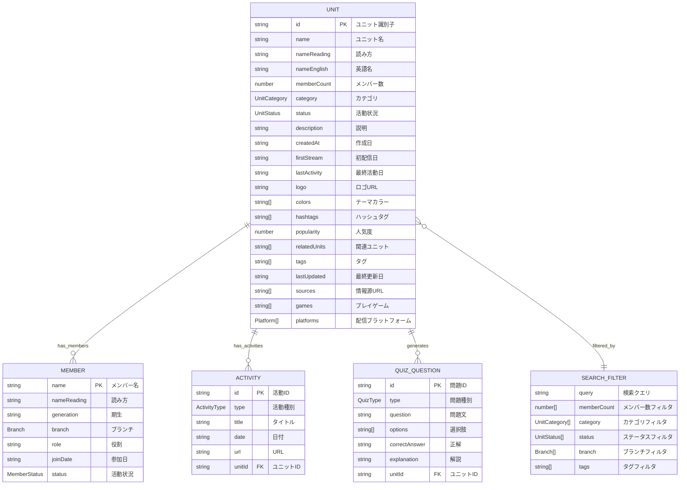
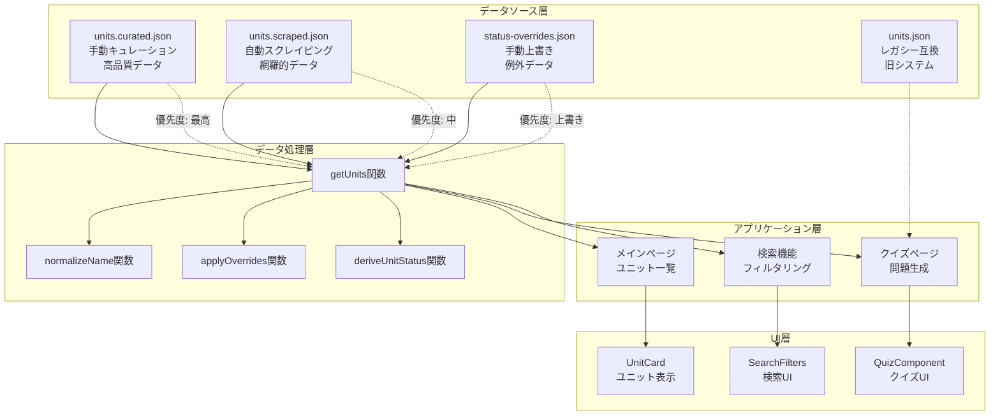
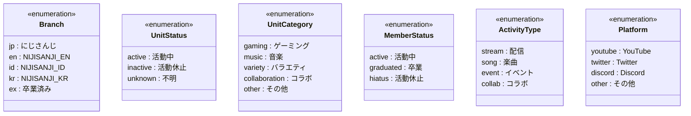
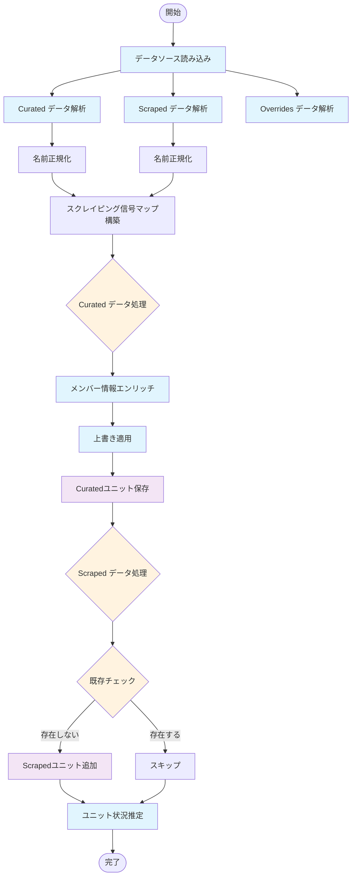
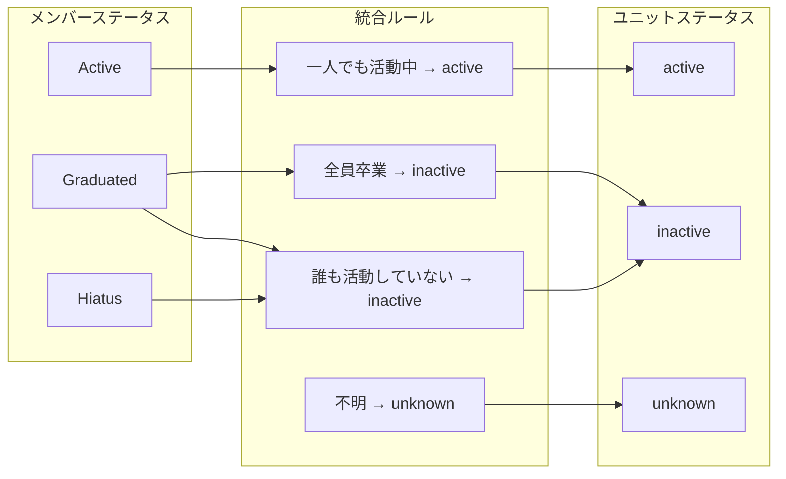
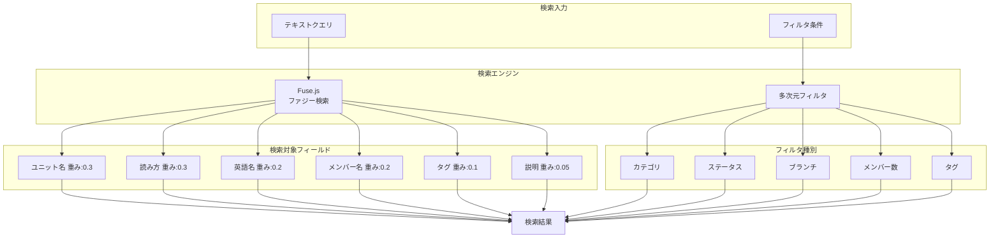
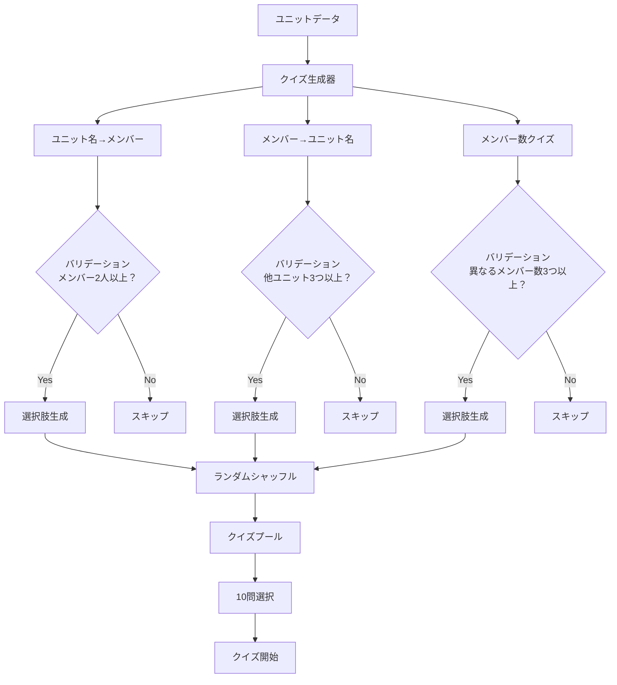
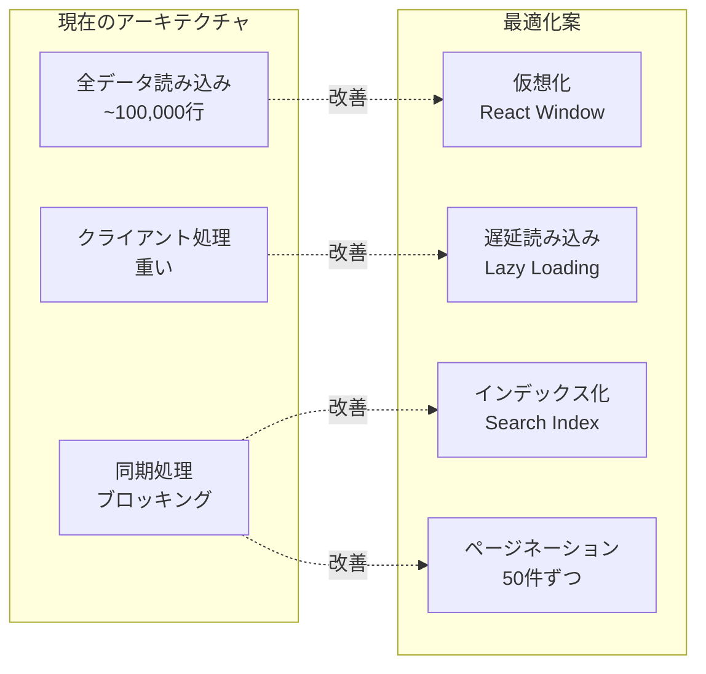

# データベース設計 - にじユニットDB

## 概要

にじユニットDBは、にじさんじVTuberのコラボレーションユニット情報を管理するデータベースシステムです。
多層データソース管理とリアルタイムデータ統合を特徴とする設計になっています。

## 論理設計

### エンティティ関係図 (ERD)

### データソース管理アーキテクチャ

## 型定義

### 列挙型 (Enums)

## データ統合ロジック

### データマージング処理フロー

### ステータス統合ルール

## 検索・フィルタリング設計

### 検索アーキテクチャ

## クイズシステム設計

### クイズ生成ロジック

## パフォーマンス考慮事項

### データ読み込み最適化

## 今後の拡張計画

### フェーズ1: パフォーマンス改善
- 仮想スクロール実装
- 検索インデックス最適化
- 遅延読み込み

### フェーズ2: リアルタイム化
- WebSocket通知
- 増分更新システム
- キャッシュ戦略

### フェーズ3: API化
- REST API実装
- データベース統合
- 認証システム

---

**作成日**: 2024年1月15日  
**最終更新**: 2024年1月15日  
**バージョン**: 1.0  