# 改善されたデータベース設計 - ミック原則準拠

## 概要

「達人に学ぶDB設計徹底指南書」のミック原則に基づいて設計した、正規化されたデータベース設計案です。

## 正規化されたエンティティ設計

### 基本エンティティ

```mermaid
erDiagram
    UNIT {
        bigint unit_id PK "代理キー"
        varchar unit_name UK "ユニット名(一意)"
        varchar name_reading "読み方"
        varchar name_english "英語名"
        varchar description "説明"
        date created_at "作成日"
        date first_stream_at "初配信日"
        date last_activity_at "最終活動日"
        varchar logo_url "ロゴURL"
        int popularity_score "人気度スコア"
        timestamp last_updated_at "最終更新日時"
        timestamp created_at_system "システム作成日時"
    }

    MEMBER {
        bigint member_id PK "代理キー"
        varchar member_name UK "メンバー名(一意)"
        varchar name_reading NOT NULL "読み方"
        varchar generation_name "期生名"
        varchar role_name "役割"
        date join_date "参加日"
        timestamp created_at "システム作成日時"
    }

    BRANCH {
        varchar branch_code PK "ブランチコード"
        varchar branch_name NOT NULL "ブランチ名"
        varchar branch_name_en "英語名"
        boolean is_active "有効フラグ"
    }

    UNIT_CATEGORY {
        varchar category_code PK "カテゴリコード"
        varchar category_name NOT NULL "カテゴリ名"
        varchar description "説明"
        int display_order "表示順"
    }

    MEMBER_STATUS {
        varchar status_code PK "ステータスコード"
        varchar status_name NOT NULL "ステータス名"
        boolean is_active_status "活動中フラグ"
        int display_order "表示順"
    }

    PLATFORM {
        varchar platform_code PK "プラットフォームコード"
        varchar platform_name NOT NULL "プラットフォーム名"
        varchar base_url "ベースURL"
        boolean is_active "有効フラグ"
    }

    TAG {
        bigint tag_id PK "代理キー"
        varchar tag_name UK "タグ名(一意)"
        varchar description "説明"
        varchar color_code "色コード"
    }

    GAME {
        bigint game_id PK "代理キー"
        varchar game_name UK "ゲーム名(一意)"
        varchar game_name_en "英語名"
        date release_date "リリース日"
    }

    %% 関係エンティティ
    UNIT_MEMBER {
        bigint unit_id PK, FK
        bigint member_id PK, FK
        varchar role_in_unit "ユニット内役割"
        date joined_at "参加日"
        date left_at "脱退日"
        boolean is_active "現在のメンバーフラグ"
        timestamp created_at "レコード作成日時"
    }

    UNIT_PLATFORM {
        bigint unit_id PK, FK
        varchar platform_code PK, FK
        varchar account_url "アカウントURL"
        boolean is_primary "メインプラットフォームフラグ"
        timestamp created_at "レコード作成日時"
    }

    UNIT_TAG {
        bigint unit_id PK, FK
        bigint tag_id PK, FK
        timestamp created_at "タグ付け日時"
    }

    UNIT_GAME {
        bigint unit_id PK, FK
        bigint game_id PK, FK
        int play_frequency "プレイ頻度"
        date first_played_at "初回プレイ日"
        date last_played_at "最終プレイ日"
        timestamp created_at "レコード作成日時"
    }

    UNIT_RELATION {
        bigint unit_id_1 PK, FK "ユニット1"
        bigint unit_id_2 PK, FK "ユニット2"
        varchar relation_type "関係種別"
        varchar description "関係説明"
        timestamp created_at "レコード作成日時"
    }

    MEMBER_STATUS_HISTORY {
        bigint history_id PK "代理キー"
        bigint member_id FK "メンバーID"
        varchar status_code FK "ステータスコード"
        varchar branch_code FK "ブランチコード"
        date effective_from "有効開始日"
        date effective_to "有効終了日"
        varchar change_reason "変更理由"
        timestamp created_at "レコード作成日時"
    }

    ACTIVITY {
        bigint activity_id PK "代理キー"
        bigint unit_id FK "ユニットID"
        varchar activity_type "活動種別"
        varchar title NOT NULL "タイトル"
        date activity_date "活動日"
        varchar url "URL"
        text description "詳細説明"
        timestamp created_at "レコード作成日時"
    }

    DATA_SOURCE {
        bigint source_id PK "代理キー"
        varchar source_name NOT NULL "ソース名"
        varchar source_url "ソースURL"
        varchar source_type "ソース種別"
        boolean is_reliable "信頼性フラグ"
        timestamp last_updated_at "最終更新日時"
    }

    UNIT_SOURCE {
        bigint unit_id PK, FK
        bigint source_id PK, FK
        timestamp referenced_at "参照日時"
    }

    %% リレーションシップ
    UNIT ||--o{ UNIT_MEMBER : "has"
    MEMBER ||--o{ UNIT_MEMBER : "belongs_to"
    UNIT ||--|| UNIT_CATEGORY : "categorized_as"
    UNIT ||--o{ UNIT_PLATFORM : "uses"
    PLATFORM ||--o{ UNIT_PLATFORM : "used_by"
    UNIT ||--o{ UNIT_TAG : "tagged_with"
    TAG ||--o{ UNIT_TAG : "tags"
    UNIT ||--o{ UNIT_GAME : "plays"
    GAME ||--o{ UNIT_GAME : "played_by"
    UNIT ||--o{ UNIT_RELATION : "related_to_1"
    UNIT ||--o{ UNIT_RELATION : "related_to_2"
    MEMBER ||--o{ MEMBER_STATUS_HISTORY : "has_status_history"
    MEMBER_STATUS ||--o{ MEMBER_STATUS_HISTORY : "applied_to"
    BRANCH ||--o{ MEMBER_STATUS_HISTORY : "assigned_to"
    UNIT ||--o{ ACTIVITY : "has_activities"
    UNIT ||--o{ UNIT_SOURCE : "referenced_by"
    DATA_SOURCE ||--o{ UNIT_SOURCE : "references"
```



## 正規化レベルと改善点

### 第1正規化 (1NF) ✅
- すべてのカラムが単一値
- 配列型の排除
- 繰り返しグループの排除

### 第2正規化 (2NF) ✅
- 部分関数従属の排除
- 関係エンティティによる M:N 関係の解決

### 第3正規化 (3NF) ✅
- 推移関数従属の排除
- 計算項目の排除

### ボイス・コッド正規化 (BCNF) ✅
- 決定項が候補キーでない関数従属の排除

## ビューによるアプリケーション互換性

```sql
-- 既存アプリケーション互換用ビュー
CREATE VIEW unit_with_members AS
SELECT 
    u.unit_id,
    u.unit_name,
    u.name_reading,
    u.name_english,
    uc.category_code as category,
    -- メンバー数の計算
    (SELECT COUNT(*) 
     FROM unit_member um 
     WHERE um.unit_id = u.unit_id 
       AND um.is_active = true) as member_count,
    -- ステータスの導出
    CASE 
        WHEN EXISTS(
            SELECT 1 FROM unit_member um
            JOIN member_status_history msh ON um.member_id = msh.member_id
            JOIN member_status ms ON msh.status_code = ms.status_code
            WHERE um.unit_id = u.unit_id 
              AND um.is_active = true
              AND msh.effective_to IS NULL
              AND ms.is_active_status = true
        ) THEN 'active'
        ELSE 'inactive'
    END as status,
    u.description,
    u.created_at,
    u.last_updated_at
FROM unit u
JOIN unit_category uc ON u.category_code = uc.category_code;

-- メンバー情報付きビュー
CREATE VIEW unit_members_detail AS
SELECT 
    u.unit_id,
    u.unit_name,
    m.member_id,
    m.member_name,
    m.name_reading as member_name_reading,
    m.generation_name,
    b.branch_code,
    b.branch_name,
    ms.status_code,
    ms.status_name,
    um.role_in_unit,
    um.joined_at,
    um.is_active as is_current_member
FROM unit u
JOIN unit_member um ON u.unit_id = um.unit_id
JOIN member m ON um.member_id = m.member_id
LEFT JOIN member_status_history msh ON m.member_id = msh.member_id 
    AND msh.effective_to IS NULL
LEFT JOIN member_status ms ON msh.status_code = ms.status_code
LEFT JOIN branch b ON msh.branch_code = b.branch_code;
```

## 主要改善点

### 1. 正規化の徹底
- 配列フィールドを関係エンティティに分解
- 計算項目（memberCount, status）を導出ロジックに変更
- 履歴管理の導入

### 2. 制約の強化
```sql
-- 必須項目の制約
ALTER TABLE member 
ADD CONSTRAINT chk_member_name_reading 
CHECK (name_reading IS NOT NULL AND length(trim(name_reading)) > 0);

-- 日付の整合性制約
ALTER TABLE member_status_history
ADD CONSTRAINT chk_effective_date_range
CHECK (effective_from <= COALESCE(effective_to, current_date));

-- ユニット内でのメンバー一意性
CREATE UNIQUE INDEX idx_unit_member_unique
ON unit_member (unit_id, member_id)
WHERE is_active = true;
```

### 3. パフォーマンス最適化
```sql
-- 検索用インデックス
CREATE INDEX idx_unit_name_search ON unit USING gin(to_tsvector('japanese', unit_name));
CREATE INDEX idx_member_name_search ON member USING gin(to_tsvector('japanese', member_name));

-- 関係エンティティのインデックス
CREATE INDEX idx_unit_member_unit_id ON unit_member (unit_id) WHERE is_active = true;
CREATE INDEX idx_unit_tag_tag_id ON unit_tag (tag_id);
```

## データ移行戦略

### フェーズ1: 並行運用
1. 新テーブル作成
2. 既存JSONからのデータ移行
3. ビューによる互換性維持

### フェーズ2: 段階的移行
1. 新APIエンドポイントの提供
2. フロントエンドの段階的移行
3. パフォーマンステスト

### フェーズ3: 完全移行
1. 旧システムの廃止
2. ビューの最適化
3. 運用監視の確立

## 利点

### データ整合性
- ✅ 参照整合性制約による品質保証
- ✅ CHECK制約による業務ルール実装
- ✅ 正規化による更新異常の排除

### 保守性
- ✅ 単一責任原則に基づくテーブル設計
- ✅ 履歴管理による監査ログ
- ✅ 明確な命名規則

### 拡張性
- ✅ 新しいメタデータの追加容易性
- ✅ 関係エンティティによる柔軟な関係管理
- ✅ 段階的な機能追加への対応

### パフォーマンス
- ✅ 適切なインデックス設計
- ✅ 正規化による無駄なデータ重複排除
- ✅ ビューによるクエリ最適化

---

**この設計により、ミック原則に完全準拠した堅牢なデータベースシステムが実現できます。**